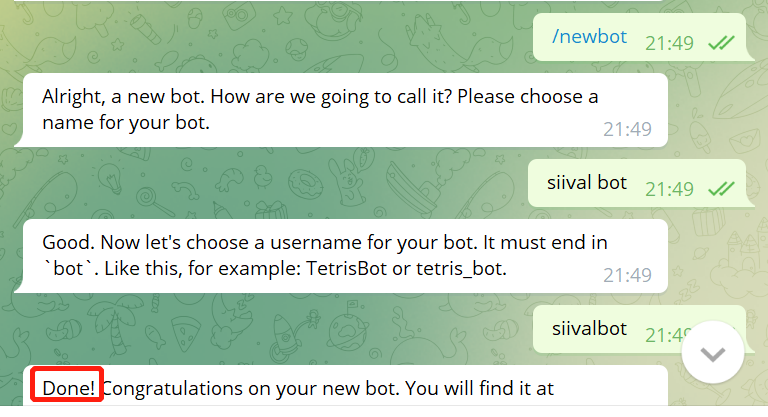
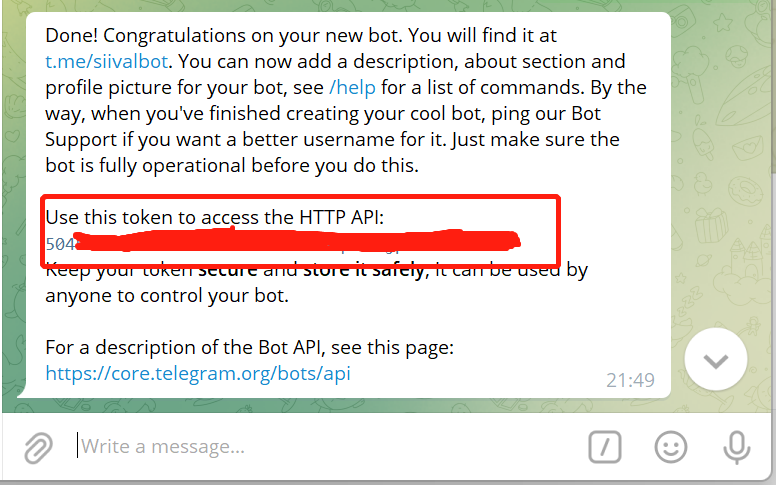

## telegrambotapi

封装java版的telegrambotapi功能，包含tg各种方法的调用

### 1. 登录tg创建一个bot

登录tg，这个你懂的。创建bot，[参考链接botfather](https://core.telegram.org/bots/#6-botfather)

[点此跳转](https://t.me/botfather)

### 2.根据操作提示创建



​      出现如上图所示`Done`表示创建完成，获取*token*，如下图所示：



​      **请妥善保管此token！！！**

​	  **请妥善保管此token！！!**

​      **请妥善保管此token！！!**

### 3. 利用token调用api

调用不同的`method`，携带不同的`params`，返回不同的`response`

```java
TelegramBots<BooleanResponse> t = new DefaultBots(token, true);
try {
    SetCommandParams params = new SetCommandParams();
    List<BotCommand> list = new ArrayList<>();
    BotCommand command = new BotCommand();
    command.setCommand("chatwithme");
    command.setDescription("you can send a message to me");
    list.add(command);
    BotCommand command1 = new BotCommand();
    command1.setCommand("welcome");
    command1.setDescription("hi buddy, welcome to my bot");
    list.add(command1);
    params.setCommands(list);
    BooleanResponse r = t.callMethod(MethodEnum.SETMYCOMMANDS, params);
    System.out.println(r);
} catch (Exception e) {
    e.printStackTrace();
}
```

